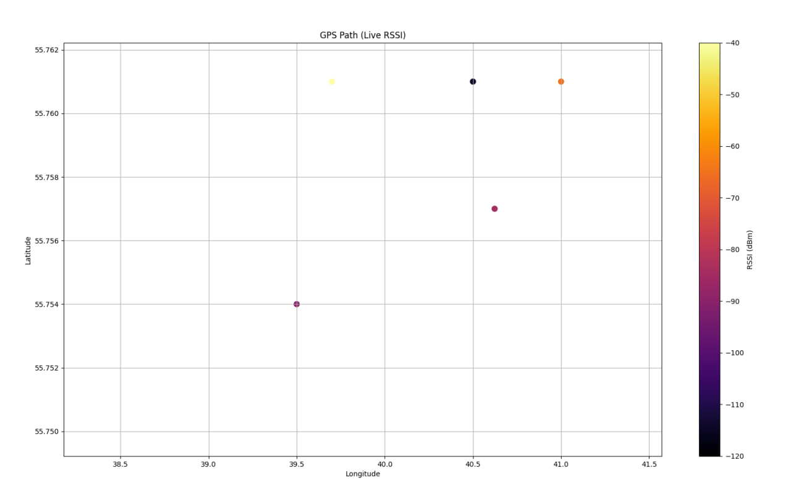

# android GPS/LTE
- Проект для сбора GPS-координат и LTE-параметров сигнала с Android-устройства, передачи их на сервер и последующей визуализации маршрута с уровнем сигнала.

схема проекта:
```
android app  →  ZeroMQ server  →  PostgreSQL  →  live plot (matplotlib)
```
## andoird app (`TcpClient.kt`)
- Находится в сабмодуле: `android_app`

Функции:
- получение GPS (`latitude, longitude, altitude, speed`)
- сбор LTE-параметров (`RSSI, RSRP, RSRQ, RSSNR, PCI/MCC/MNC`)
- отправка данных на сервер по ZeroMQ (`REQ/REP`)
- очередь данных при потере соединения, накопление буфера, когда соединение с сервером будет установленно выплевываем все накопленные записи

## server (`tcp_server_android_app/server.py`)
- python-сервер на ZeroMQ, принимающий JSON-ку от android app

Функции:
- принимает данные от android
- парсит GPS + LTE информацию
- сохраняет данные в PostgreSQL
- отвечает клиенту статусами (`saved, db_error`)

## data base (`postgresql`)
поля, которые сохраняем:
- device_id
- latitude / longitude / altitude
- speed
- timestamp (android)
- server_time
- rssi / rsrp / rsrq / rssnr
- pci / mcc / mnc

## визуализация (`tcp_server_android_app/lat_lon_mapper.py`)
live-график маршрута устройства:
- цвет точки отражает уровень RSSI
- данные обновляются каждые 3 секунды

## screenshots


